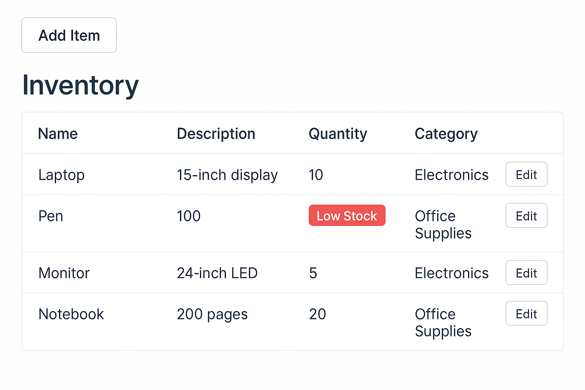
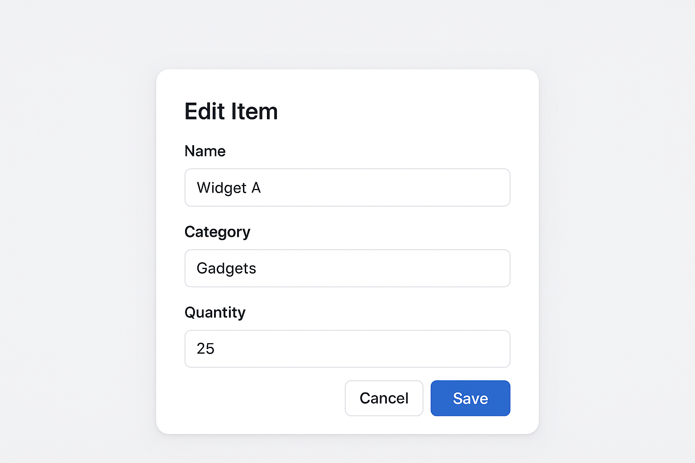

# 📦 Inventory Tracker – Features List

## ✅ Phase 1: Core Features (Beginner-Level)
- [X] Add Item
  - [X] Form: name, description, quantity, category
  - [X] POST to backend
  - [X] Basic form validation

- [ ] View Inventory List
  - [X] Table/card layout
  - [X] Show name, description, quantity, category
  - [ ] Highlight "Low Stock" (quantity < 5)

- [X] Edit Item
  - [X] Modal or route-based edit form
  - [X] Load existing data
  - [X] PUT to backend

- [ ] Delete Item
  - [ ] Delete button with confirmation
  - [ ] DELETE API call
---

## ✳️ Phase 2: Useful Extras
- [ ] Search / Filter
  - Filter by category
  - Search by name or description

- [ ] Pagination or Infinite Scroll
  - Show limited items per page
  - Add next/prev buttons

- [ ] Low Stock Summary
  - Show count of low stock items

- [ ] Sort Inventory
  - Sort by name, quantity, or category

---

## 🌟 Phase 3: Optional Enhancements
- [ ] Authentication (JWT)
  - Login/register
  - Authenticated access to API

- [ ] Export Inventory
  - Export list as CSV or PDF

- [ ] Category Management
  - Separate page for CRUD on categories
  - Items use category IDs

- [ ] Item Images
  - Upload image per item
  - Display in item card/view

- [ ] Activity Log
  - Track who created/edited/deleted
  - Show log timeline

---

